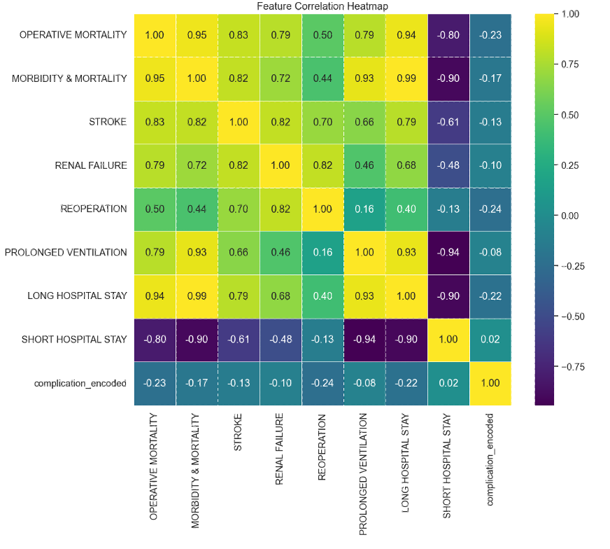
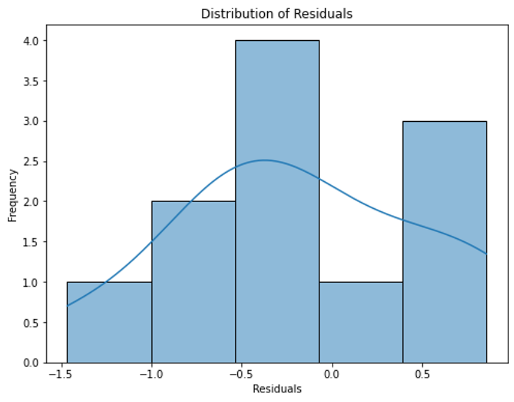
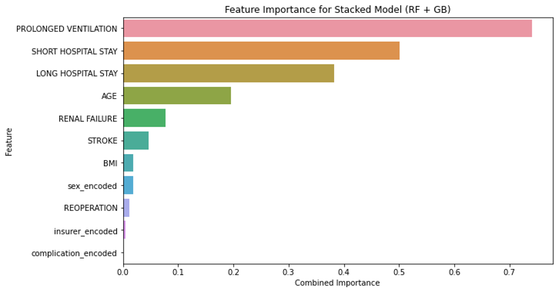
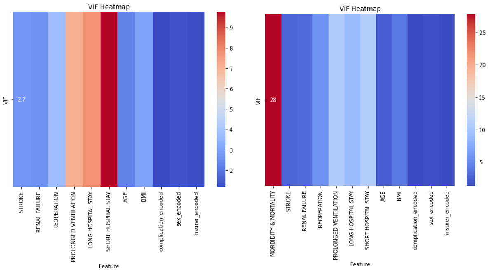
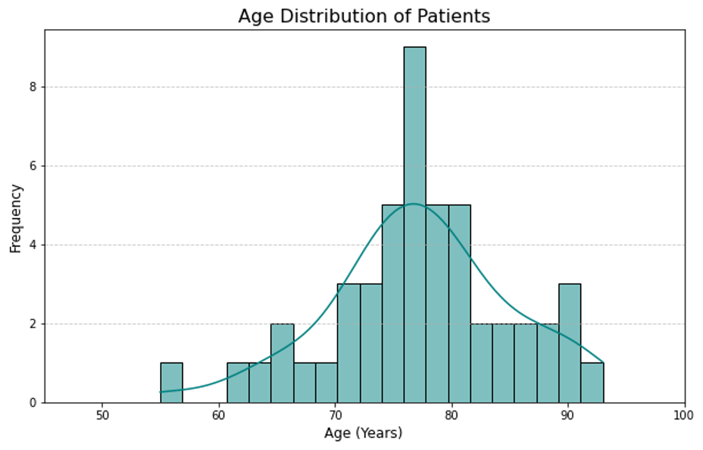

# Predictive Model for Clinical Excellence in Cardiac Surgery

## Overview

This repository contains a machine learning-based clinical support tool that predicts postoperative risks in cardiac surgery using preoperative patient data. The project focuses on optimizing surgical planning by forecasting adverse outcomes such as operative mortality, renal failure, prolonged ventilation, and stroke. The model was designed in alignment with the Society of Thoracic Surgeons (STS) database standards and supports broader initiatives like achieving 3-star STS program ratings.

## Project Context

Developed in collaboration with clinical requirements from HCA Houston Clear Lake, the project aims to simplify and automate the predictive modeling of adverse surgical outcomes that were traditionally estimated using Excel-based STS calculators. The goal is to streamline data entry, reduce human error, and eventually support real-time decision-making in surgical settings.

## Objectives

- Predict key clinical outcomes using preoperative variables, with a focus on operative mortality.
- Support hospital quality initiatives tied to STS ratings.
- Provide a reproducible and extensible ML pipeline for clinical risk modeling.
- Enable integration into hospital systems via saved models or APIs.

## Methodology

### Data Preprocessing
- Filled missing values, removed rows with NaNs, and normalized features using `MinMaxScaler`.
- One-hot encoded categorical variables such as gender, insurer, and procedure type.
- Feature selection guided by correlation analysis and model-based importance.

<figure>
  
  <figcaption align="center"><b>Figure 1:</b> Correlation heatmap showing relationships between predictors.</figcaption>
</figure>

### Modeling Techniques
- Gradient Boosting Regressor for non-linear relationship handling.
- Stacking Ensemble with Random Forest and Gradient Boosting to boost robustness.
- Hyperparameter tuning with `RandomizedSearchCV`.
- Optional transformation using Yeo-Johnson to improve residual distribution.

### Evaluation Metrics
- R² Score: 0.78 (main.py model), 0.81 (stacked TAVR model)
- Mean Squared Error: 0.04 (main.py model), 0.12 (TAVR model)

<figure>
  
  <figcaption align="center"><b>Figure 2:</b> Residual distribution of model predictions shows low bias.</figcaption>
</figure>

## Key Findings

- Renal failure, prolonged ventilation, and short hospital stay were the strongest predictors of mortality.
- Feature correlation was assessed using VIF; removal of multicollinear features improved model performance.
- Ensemble modeling significantly increased accuracy, indicating robustness against clinical variability.

<figure>
  
  <figcaption align="center"><b>Figure 3:</b> Top features ranked by importance in predicting operative mortality.</figcaption>
</figure>

<figure>
  
  <figcaption align="center"><b>Figure 4:</b> VIF analysis before and after feature pruning to reduce multicollinearity.</figcaption>
</figure>

## Clinical Impact

- Aligns with STS-defined outcomes (mortality, stroke, AKI, etc.).
- Proven capability to estimate a 3-star program rating based on expected/observed outcome ratios.
- Can be integrated into weekly surgical review workflows to assist clinicians in prioritizing care.

## Data Distribution Insight

<figure>
  
  <figcaption align="center"><b>Figure 5:</b> Age distribution of patient data used for model training and testing.</figcaption>
</figure>

## File Structure

```
Cardiac-Surgery-Predictive-Model/
│
├── main.py                          # Core pipeline: preprocessing → training → evaluation
├── Surgical_Predictive_Model_Final.ipynb   # Jupyter Notebook version for interactive analysis
├── main_fresh_complete_data_only.ipynb     # Cleaned notebook for batch testing
├── Project proposal.pdf             # Step-by-step strategy and model scope
├── Decision Analysis Presentation.pptx     # TAVR model slides for stakeholder presentation
├── OU_ELM Engineers.pdf             # Domain context and clinical goals
├── ModelData_2425.xlsx              # Cleaned dataset
├── best_gradient_boosting_model.pkl # Exported model for reuse or deployment
└── README.md
```

## Technologies Used

- Python 3.10
- Pandas, NumPy for data manipulation
- Seaborn, Matplotlib for visualization
- Scikit-learn, XGBoost (optional), TensorFlow (future extension)
- JupyterLab / VS Code for development
- Git and GitHub for version control and collaboration

## Future Work

- Build models for additional surgeries: AVR, MVR, AVR/CABG, MVR/CABG, and TAVR
- Validate with real-time hospital data feeds
- Build front-end UI or API for clinicians to input data and receive predictions
- Consider fairness and bias in model predictions, especially across age and ethnicity

## Authors

Abdulmalik Ajisegiri  
MS Systems Engineering, University of Oklahoma  
Email: abdulmalik.ajisegiri@ou.edu
